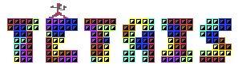

# C64 Tetris

<br/>
<div align="center">
<a href="https://github.com/ShaanCoding/makeread.me">

</a>
</div>


# Tetris para Commodore 64 (C64) en Kick Assembler

## Introducción

Este proyecto es un clona del clásico juego **Tetris**, desarrollado para Commodore 64 (C64) utilizando **Kick Assembler**. El objetivo fue recrear las mecánicas centrales de Tetris, incluyendo el movimiento de las piezas, la rotación, la eliminación de líneas y el cálculo de puntajes, mientras se trabaja dentro de las limitaciones del hardware del C64.

## Inspiración: Mi primer computadora y el comienzo de una pasión

Mi primera computadora no fue solo una herramienta; fue la chispa que encendió mi pasión por la programación. Aunque en ese momento carecía de conocimientos y documentación (y mucho estaba en inglés), siempre soñé con desarrollar un juego en ensamblador. Ese sueño me acompañó toda la vida, y aunque empecé tarde, a los 50 años, decidí que nunca es tarde para aprender y perseguir lo que amas. Mi primera computadora me dio mi vocación, pero fue la determinación lo que me llevó a seguir ese sueño.

**Inspirado e incorpora mecánicas del juego arcade Tetris de Atari de 1989.**

## Características

-	Jugabilidad clásica de Tetris con tetrominós que caen.
-	Compatibilidad con joystick en el Puerto 2 de la Commodore 64 para una experiencia de juego auténtica.
-	Cálculo de puntuación basado en las líneas completadas.
-	Progresión de niveles con dificultad creciente.
-	Detección de game over cuando los bloques alcanzan la parte superior de la pantalla.
-	Opción de activar/desactivar música.
-	Estadísticas en el juego (piezas colocadas, líneas completadas, etc.).
-	Pantalla de título y menú para opciones de juego.
-	Múltiples niveles con progresión automática.
-	Modo ancho con un campo de juego más amplio (14 columnas de ancho en lugar de las 10 estándar).
-	Selección del nivel inicial desde el menú antes de empezar la partida.

## Cómo se hizo el juego

“El desarrollo del juego se basó en gran medida en un curso de [Tutoriales de Board-b](https://www.youtube.com/@board-b-tutorials), que proporciona una explicación detallada de cómo crear un juego en Kick Assembler. Además, se utilizó código fuente del curso, sin lo cual este proyecto no habría sido posible.”

### 1. Rejilla y representación de Tetromino

La cuadrícula del campo de juego se implementó como un arreglo bidimensional, con cada celda representando un espacio ocupado o desocupado. Los tetrominós (piezas del juego) se definieron utilizando patrones de bits, donde cada tetromino es una matriz de 4x4 bits.

- **Tetrominós:** Cada forma de tetromino (I, O, T, L, J, Z, S) se almacena como una serie de bytes en memoria, representando sus estados de rotación.
- **Rotación:** (En el sentido de las agujas del reloj): La rotación de los tetrominós se manejó cambiando los bits dentro de la matriz y rotando las piezas en el sentido de las agujas del reloj. El juego asegura que el tetromino pueda rotar libremente dentro de los límites de la cuadrícula, verificando posiciones válidas durante cada rotación.

### 2. Controles

Los controles se implementaron utilizando la entrada del **teclado**, con teclas específicas asignadas para moverse a la izquierda, a la derecha, rotar y dejar caer la pieza:

- `Flecha izquierda`: Moverse a la izquierda
- `Flecha derecha`: Moverse a la derecha
- `Espacio`: Rotar (En el sentido de las agujas del reloj)
- `Flecha hacia abajo`: Caer más rápido

### 3. Detección de colisiones

La detección de colisiones fue una parte clave de la lógica del juego para asegurar que los tetrominós no se superpongan o salgan de los límites. El juego verifica las colisiones entre los tetrominós y los bordes de la cuadrícula o los bloques colocados existentes.

### 4. Eliminación de líneas y puntuación

El juego detecta cuando una línea horizontal está completamente llena de bloques. Cuando esto sucede, la línea se elimina y todos los bloques por encima de ella bajan. El sistema de puntuación se implementó para otorgar puntos por cada línea eliminada, con bonificaciones por eliminar múltiples líneas simultáneamente.

### 5. Gráficos y sonido

- **Gráficos:** Los gráficos del juego se diseñaron utilizando el modo de gráficos basado en caracteres del C64. Cada tetromino está representado por un bloque de caracteres, y el campo de juego utiliza conjuntos de caracteres personalizados para una apariencia limpia.
- **Música:** En lugar de crear composiciones originales, incorporé música del repositorio [SIDPLAY](http://www.sidmusic.org/), utilizando el chip SID. Esto proporcionó una banda sonora atractiva que respondía dinámicamente a acciones del juego como eliminar líneas y rotar piezas, mejorando la experiencia de juego en general.

## Cómo ejecutar

Para ejecutar este juego en un emulador de C64 o en hardware real:

1. Ensamble el código fuente utilizando **Kick Assembler**.
   ```bash
   kickass main.asm
   ```
2. Cargue el archivo `.prg` resultante en un emulador de C64 como **VICE** o en un Commodore 64 real.

## Herramientas de desarrollo

- **Kick Assembler**: El ensamblador principal utilizado para codificar este proyecto.
- **VICE**: Un emulador de C64 utilizado para probar el juego.
- **CharPad**: Utilizado para diseñar el conjunto de caracteres personalizados.
- **SpritePad**: Utilizado para diseñar el conjunto de sprites personalizados.
- **Visual Studio Code**: El editor de código principal para el proyecto, ofreciendo un entorno robusto para escribir y gestionar código de ensamblaje de manera eficiente.
- **Trello**: Utilizado para la gestión del proyecto para organizar tareas, seguir el progreso y coordinar los hitos del desarrollo de manera efectiva.
- **Google Sheets**: Empleado para diseñar niveles de juego y configuraciones de piezas, permitiendo una fácil visualización y modificación de elementos del juego. [Hoja de Tetris C64](https://docs.google.com/spreadsheets/d/1_ig19sMXD00o047gIRUfUvoIk_laGAnXPoKrUIsnIFE/edit?usp=sharing)

## Referencias

Aquí están algunas referencias que utilicé para completar este proyecto:

1. **Documentación de Kick Assembler** - Para aprender sobre instrucciones de ensamblaje y características específicas de Kick Assembler.
   - [Manual de Kick Assembler](http://theweb.dk/KickAssembler/WebHelp/)

2. **Mapa de memoria y arquitectura del C64** - Para entender el diseño de memoria y las capacidades de hardware del C64.
   - [Guía de referencia del programador del C64](http://www.zimmers.net/cbmpics/cbm/c64/vic-ii.txt)

3. **Programación del chip SID** - Para generar efectos de sonido.
   - [Guía de programación del chip SID](https://www.c64-wiki.com/wiki/SID)

4. **Mecánicas de Tetris** - Comprensión general de cómo funcionan las mecánicas originales del juego Tetris.
   - [Wiki de Tetris](https://tetris.wiki/Tetris_Guideline)

5. **Tutoriales de board-b** - Para aprender sobre instrucciones de ensamblaje y características específicas de Kick Assembler.
    - [Canal de YouTube de board-b](https://www.youtube.com/@board-b-tutorials)

6. **SpritePad & CharPad** - [Subchrist Software](https://itch.io/profile/subchristsoftware)

## Licencia

Este proyecto se lanza bajo la Licencia MIT. Eres libre de usar, modificar y distribuir este código siempre que se otorgue el crédito adecuado.

## Tetris

- [Wiki](https://es.wikipedia.org/wiki/Tetris)
- [Sitio Oficial](https://www.tetris.com/)
- [Historia](https://vadim.oversigma.com/Tetris.htm)

## Importante

**Todos los derechos de Tetris pertenecen a sus respectivos dueños. Este proyecto está inspirado en Tetris y es solo para fines educativos, sin intención comercial.**

**Música**: New Song - Autor [Leigh White (Racer X)](https://csdb.dk/release/?id=17674) ❤️❤️❤️